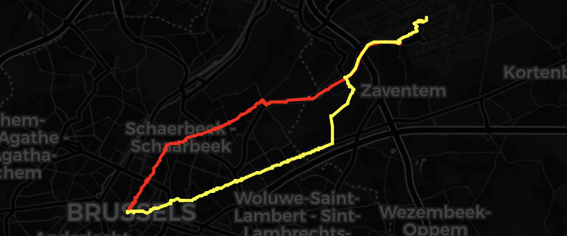

# OSMdataForBrussels

This contains a jupyter notebook that will fetch biking and walking infrastructure for 
Brussels, Belgium. The two datasets are then saved to shapefiles (containing nodes and edges), which
can then be used in another GIS software. These shapefiles are stored in 'exportedData'.

questions? [delmelle@gmail.com](delmelle@gmail.com) 
